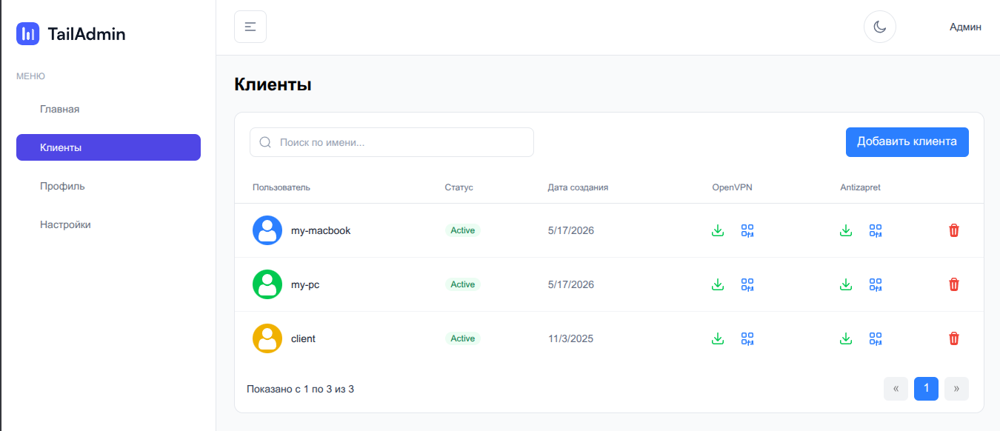
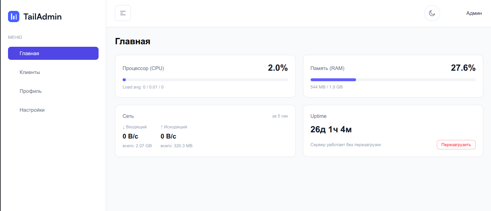

# Админ-панель AntiZapret

Веб-интерфейс для управления VPN-сервером [AntiZapret-VPN](https://github.com/GubernievS/AntiZapret-VPN).

> **Требование:** на сервере должен быть установлен [AntiZapret-VPN](https://github.com/GubernievS/AntiZapret-VPN) — эта панель является интерфейсом управления для него.

Стек: **Go (Golang)** + **Vue 3**. Компилируется в **единый бинарный файл** (Linux amd64), содержащий внутри себя скомпилированный фронтенд.

## Скриншоты





---

## Установка (Linux)

Установка и обновление выполняются одной командой. Скрипт автоматически:
1. Скачает последний релиз.
2. Установит бинарник в `/usr/local/bin/antizapret-admin`.
3. Настроит и запустит systemd-сервис `antizapret-admin.service`.

```bash
curl -sSL https://github.com/d1skord/antizapret-admin-panel/releases/latest/download/install.sh | sudo bash
```

Если у вас возникает ошибка при вводе пароля (например, в неинтерактивной среде):

```bash
curl -sSL https://github.com/d1skord/antizapret-admin-panel/releases/latest/download/install.sh | sudo ADMIN_PASSWORD="ваш_пароль" bash
```

После установки панель будет доступна по адресу: `http://<IP-ВАШЕГО-СЕРВЕРА>:8080`

### Удаление

```bash
sudo antizapret-admin-uninstall
```

---

## Архитектура проекта

- `main.go` — точка входа, встраивает `frontend/dist` через `embed`
- `frontend/` — Vue 3 приложение (Vite)
- `internal/` — логика бэкенда (API, работа с файлами конфигурации VPN)
- `deploy/` — файлы для деплоя (systemd unit, uninstall script)
- `mock_fs/` — фейковая файловая система для локальной разработки
